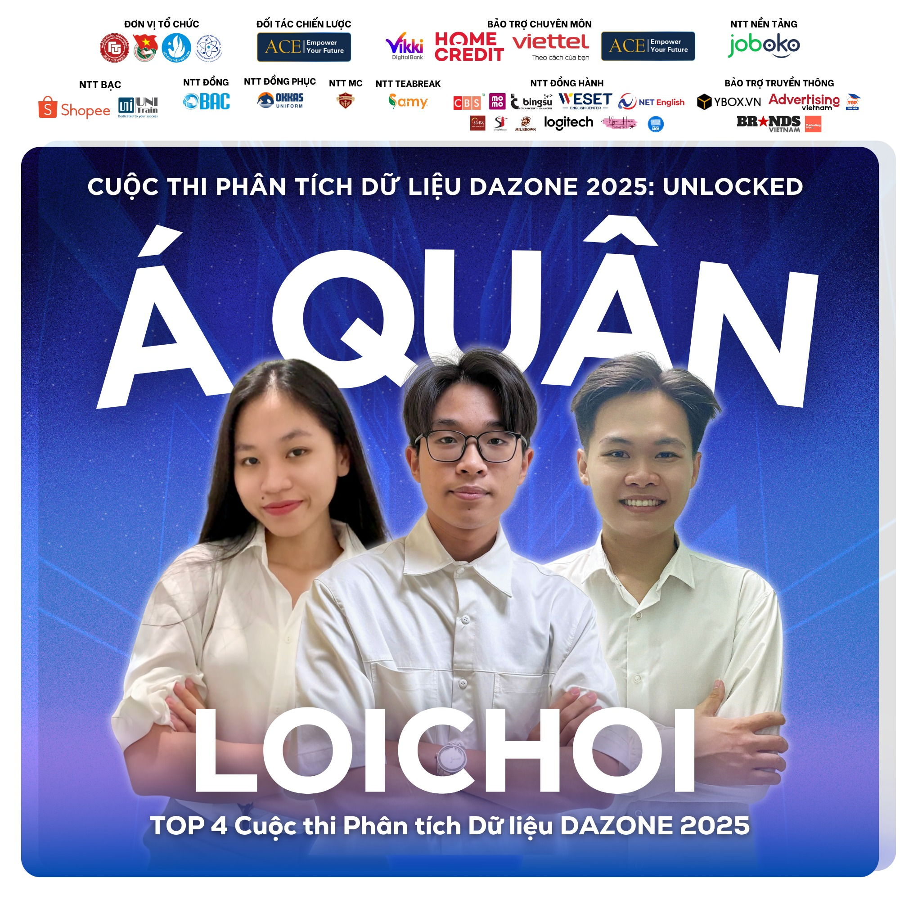
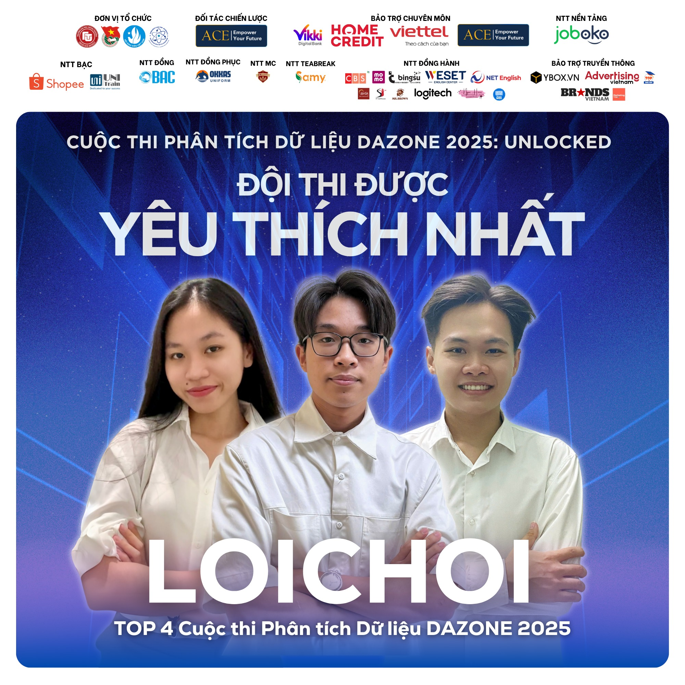

<h1><strong><a href="https://www.facebook.com/DAZONE.RCS" style="color:#9c191b; text-decoration:none; font-weight:bold;">CUỘC THI PHÂN TÍCH DỮ LIỆU DAZONE 2025</a></strong></h1>


<h2><strong><span style="color:#ee0434; font-weight:bold">👋 INTRODUCTION</span></strong></h2>

**1. LOICHOI - Team members**

| Fullname              | University | Tasks                                         |
|-----------------------|:----------:|:---------------------------------------------:|
| Vo Tran Thi My Van    | HCMUT      | Exploratory Data Analysis/ Project Management |
| Nguyen Tuan Huy       | HCMUT      | Data Wrangling/ Data Modeling                 |
| Tran Nguyen Quang Huy | UEH        | Gaining Insight/ Strategic Marketing Planning |

**2. About LOICHOI**

  We're **LOICHOI Team**, a group of high school friends who entered this competition together.

  Back in 2024, our journey unfortunately ended in Round 1. But we returned in 2025, and were incredibly surprised by our results, making it all the way to the end of the contest. Honestly, this was our first time reaching the finals and presenting our product on stage. We are very thankful for this unique chance we've been given during our student years.

  Through this competition, we gained invaluable knowledge in the data world, from preprocessing &rarr; visualization &rarr; gaining insights &rarr; modeling &rarr; proposing suitable actions for problems. We also received excellent feedback from our mentors and examiners, who praised our analytical, logical, and systems thinking skills.

<p align="center">
  
  
</p>


<h2><strong><span style="color:#ee0434; font-weight:bold">🗂️ PROJECT STRUCTURE</span></strong></h2>

```
DAZONE_2025/
├── certificate/                  # Certificate storage
├── Round_2/                      # Everything in round 2
    ├── data/                     # Dataset storage
    ├── cleaned_data/             # Cleaned dataset storage
    ├── filled_data/              # Filled dataset storage for modeling
    ├── data_clustering/          # Clustering dataset by K-means 
    ├── 2.1-preprocessing.ipynb   # Jupyter notebooks for preprocessing
    ├── 2.1-report.pdf            # Report for case study 2.1
    ├── 2.2-modeling.ipynb        # Jupyter notebooks for modeling
    └── 2.2-slide.pdf             # Slide presentation for round 2.2
├── Round_3/                      # Everything in round 3
    ├── data/                     # Dataset storage
    ├── cleaned_data/             # Cleaned dataset storage
    ├── filled_data/              # Filled dataset storage for modeling
    ├── overall.ipynb             # Jupyter notebooks for overall dataset
    ├── preprocessing.ipynb       # Jupyter notebooks for preprocessing
    ├── EDA.ipynb                 # Jupyter notebooks for EDA data by Huy
    ├── EDA_van.ipynb             # Jupyter notebooks for EDA data by Van
    ├── model_1.ipynb             # Jupyter notebooks for modeling 1
    ├── model_2.ipynb             # Jupyter notebooks for modeling 2
    └── slide.pdf                 # Slide presentation for round 3
├── github.bat                    # short command in terminal for push code to github
├── .gitignore
└── README.md
```


<h2><strong><span style="color:#ee0434; font-weight:bold">🌹 NOTE FOR OURSELVES</span></strong></h2>

  We went through three Business Case rounds together. Each round was a very tiring week. It was really hard because we had to do internships, take final exams, and go to class all at the same time. Every night, we'd call each other on Discord until late to find ideas, because we were all busy with school or internships during the day.

  But somehow, we still made it through. Even if our work wasn't the best, we were lucky that good results came as a surprise. Especially in Round 2.2, our project was even rated the best among the top 10 by the judges. What was even more surprising was the great support we got from our families and friends, from the start of the competition until the very last round. Every moment of this journey has been a very special experience that nothing else can compare to.

Full respect for you guys.
